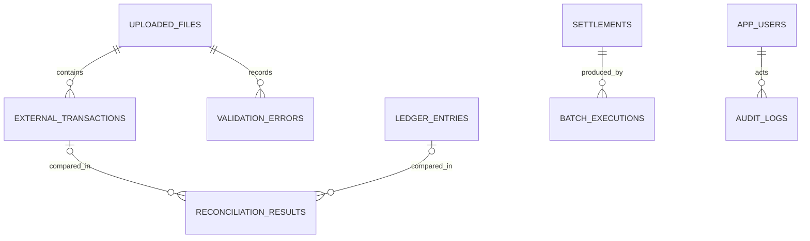

# ERD

## 초기 모델

## 테이블 책임

| 테이블 | 책임 | 주요 제약 |
| --- | --- | --- |
| `uploaded_files` | 입력 파일 처리 이력과 통계 | `content_hash` unique |
| `external_transactions` | 외부 승인/취소 거래 | `transaction_id` unique |
| `validation_errors` | 행 단위 검증 실패 | 파일 FK |
| `ledger_entries` | 내부 기준 거래 원장 | 거래 ID, 원장 참조 ID unique |
| `reconciliation_results` | 거래-원장 비교 결과 | 영업일 인덱스 |
| `settlements` | 확정된 일별 지급 결과 | `business_date` unique |
| `batch_executions` | 정산 등 작업 실행 이력 | 상태/실패 원인 |
| `app_users` | 후속 인증 사용자 | `username` unique |
| `audit_logs` | 주요 조작 이력 | 행위자/대상/시각 |

## 설계 경계

- Phase 0에서는 Flyway로 테이블 기준선만 생성한다. JPA 엔티티는 해당 도메인을 구현하는 Phase에서 DTO와 함께 추가한다.
- 외부 거래와 원장 누락 양쪽을 표현해야 하므로 대사 결과의 두 FK는 nullable이다.
- 스키마의 시간 컬럼은 초기 기준선이며 Phase 4 운영 정책에서 UTC/감사 보존 정책을 결정한다.
