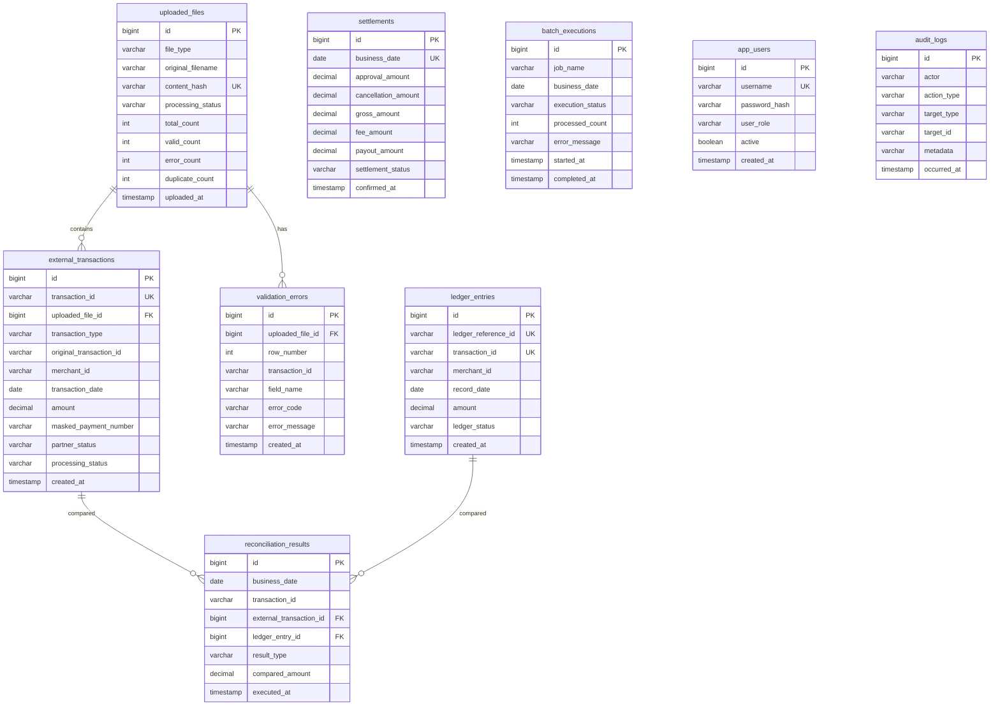

# ERD

```mermaid
erDiagram
    uploaded_files ||--o{ external_transactions : contains
    uploaded_files ||--o{ validation_errors : has
    external_transactions ||--o{ reconciliation_results : compared
    ledger_entries ||--o{ reconciliation_results : compared

    uploaded_files {
        bigint id PK
        varchar file_type
        varchar original_filename
        varchar content_hash UK
        varchar processing_status
        int total_count
        int valid_count
        int error_count
        int duplicate_count
        timestamp uploaded_at
    }

    external_transactions {
        bigint id PK
        varchar transaction_id UK
        bigint uploaded_file_id FK
        varchar transaction_type
        varchar original_transaction_id
        varchar merchant_id
        date transaction_date
        decimal amount
        varchar masked_payment_number
        varchar partner_status
        varchar processing_status
        timestamp created_at
    }

    validation_errors {
        bigint id PK
        bigint uploaded_file_id FK
        int row_number
        varchar transaction_id
        varchar field_name
        varchar error_code
        varchar error_message
        timestamp created_at
    }

    ledger_entries {
        bigint id PK
        varchar ledger_reference_id UK
        varchar transaction_id UK
        varchar merchant_id
        date record_date
        decimal amount
        varchar ledger_status
        timestamp created_at
    }

    reconciliation_results {
        bigint id PK
        date business_date
        varchar transaction_id
        bigint external_transaction_id FK
        bigint ledger_entry_id FK
        varchar result_type
        decimal compared_amount
        timestamp executed_at
    }

    settlements {
        bigint id PK
        date business_date UK
        decimal approval_amount
        decimal cancellation_amount
        decimal gross_amount
        decimal fee_amount
        decimal payout_amount
        varchar settlement_status
        timestamp confirmed_at
    }

    batch_executions {
        bigint id PK
        varchar job_name
        date business_date
        varchar execution_status
        int processed_count
        varchar error_message
        timestamp started_at
        timestamp completed_at
    }

    app_users {
        bigint id PK
        varchar username UK
        varchar password_hash
        varchar user_role
        boolean active
        timestamp created_at
    }

    audit_logs {
        bigint id PK
        varchar actor
        varchar action_type
        varchar target_type
        varchar target_id
        varchar metadata
        timestamp occurred_at
    }
```
